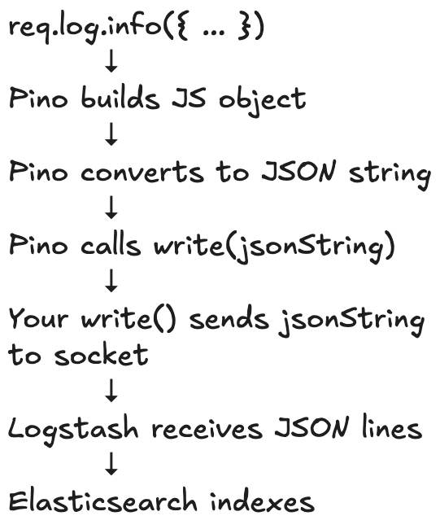
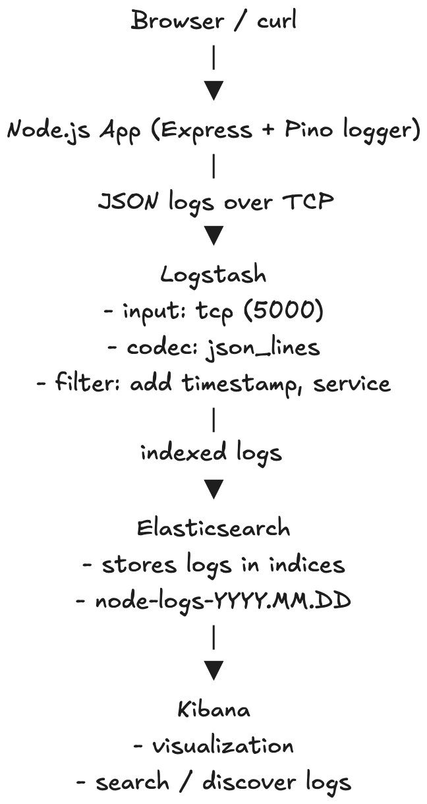

# Log Aggregation and Analysis

This demo shows a simple **log aggregation pipeline using the ELK stack**.

Logs flow through the system as:

```
Node App -> Logstash -> Elasticsearch -> Kibana
```

## Demo Steps

### 1. Start the stack

Build and start all services:

```bash
docker compose up --build -d
```

This launches:

* Node demo application
* Logstash
* Elasticsearch
* Kibana

### 2. Generate logs

Send requests to the demo app:

```bash
curl http://localhost:3000/
curl http://localhost:3000/error
curl http://localhost:3000/error
```

These requests generate **structured logs** which are sent to Logstash and stored in Elasticsearch.

### 3. Analyze logs in Kibana

Open Kibana:

```
http://localhost:5601/
```

In Kibana you can:

* search logs
* filter by fields (e.g., `route`, `statusCode`)
* visualize request and error activity

## Log Flow



## App Architecture Flow (ELK Stack)


